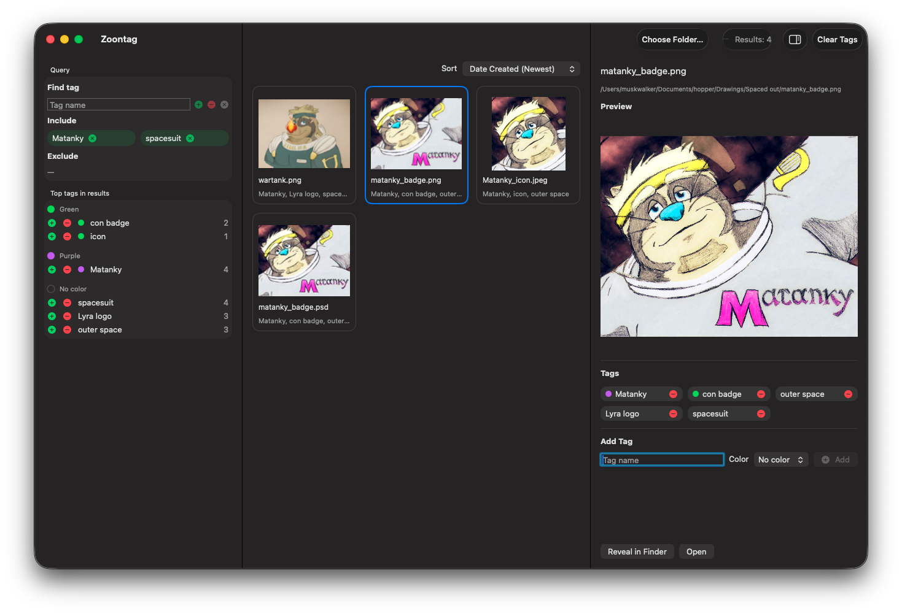

# Zoontag

Zoontag is a macOS tag-first file browser. It uses Finder tags and Spotlight to let you drill into files quickly without maintaining a separate media database.



## For End Users

### Requirements
- macOS 14 or later

### Get Zoontag

1. Go to the [Releases page](https://github.com/Muskworker/Zoontag/releases) and download `Zoontag-macOS.zip`.
2. Unzip and move `Zoontag.app` to `/Applications`.
3. Launch Zoontag.

> [!NOTE]
> macOS may block the first launch because the app is unsigned. If that happens:
> 1. Try to open `Zoontag.app` once, then dismiss the warning.
> 2. Open **System Settings > Privacy & Security**.
> 3. Click **Open Anyway** for Zoontag and confirm.
>
> Apple notes that **Open Anyway** is available for about one hour after the blocked launch attempt.

### How to Use

#### Choose a scope
Click the folder button in the toolbar to pick a folder to search. Zoontag restores your last session on launch — including selected scope, active filters, sort order, and inspector pane visibility — so you can pick up right where you left off.

#### Filter by tags
The sidebar shows tag facets computed from your current results. Click `+` next to any facet tag to include it, or `-` to exclude it. Remove an active chip to widen results back out.

To work with any tag in the selected scope — not just the top facets — use **Query > Find tag**:
- Type to get autocomplete suggestions; `Up`/`Down` to navigate, `Tab` to accept
- `+` include the typed tag, `-` exclude it, `x` remove it from current filters

The tag catalog is built in the background per scope, so suggestions stay complete even after filters narrow the visible results.

Use the center-pane **Sort** menu to order results by name, date modified, date created, or file size (ascending or descending). The toolbar shows result coverage — `Results: N`, `Results: N of M`, or `Results: N+`. When more matches are available, click **Load More** to fetch the next page in the active sort order. Click **Stop** to cancel a search in progress.

#### Manage tags on files
Click a file in the grid to select it; `Cmd`-click to build a multi-file selection. With one or more files selected, use the inspector's **Add Tag** field to apply or remove tags across the whole selection at once. Autocomplete works the same way: `Up`/`Down` to navigate suggestions, `Tab` to accept.

### Features
- Tag-first file browsing via Spotlight — no separate database required
- Boolean include/exclude filtering with sidebar facets and full-scope tag autocomplete
- Bulk tag editing across multi-file selections with keyboard-navigable autocomplete
- Flexible result sorting (name, dates, size) with incremental `Load More` paging
- Search cancel (`Stop`) and progressive result refinement for large scopes
- Session persistence across launches (scope, filters, sort, inspector state)

## For Developers

### Requirements
- macOS 14 or later
- Xcode 15 or later

### Setup
```bash
git clone https://github.com/Muskworker/Zoontag
cd Zoontag
open Zoontag.xcodeproj
```

### Build and Test
```bash
xcodebuild build -scheme Zoontag -configuration Debug
xcodebuild test -scheme Zoontag -destination 'platform=macOS' -derivedDataPath "$(pwd)/.build/DerivedData"
```

### Build Release Package
```bash
./scripts/package_release.sh
```

Pushing a `v*` tag (e.g. `v1.2.0`) triggers the GitHub Actions release workflow, which builds the package and attaches `Zoontag-macOS.zip` and its SHA-256 checksum to the [Releases page](https://github.com/Muskworker/Zoontag/releases) automatically.

### More Docs
- Contributor workflow: [CONTRIBUTING.md](CONTRIBUTING.md)
- Agent-specific guidance: [AGENTS.md](AGENTS.md)

## License
This project is licensed under the [MIT License](LICENSE).
